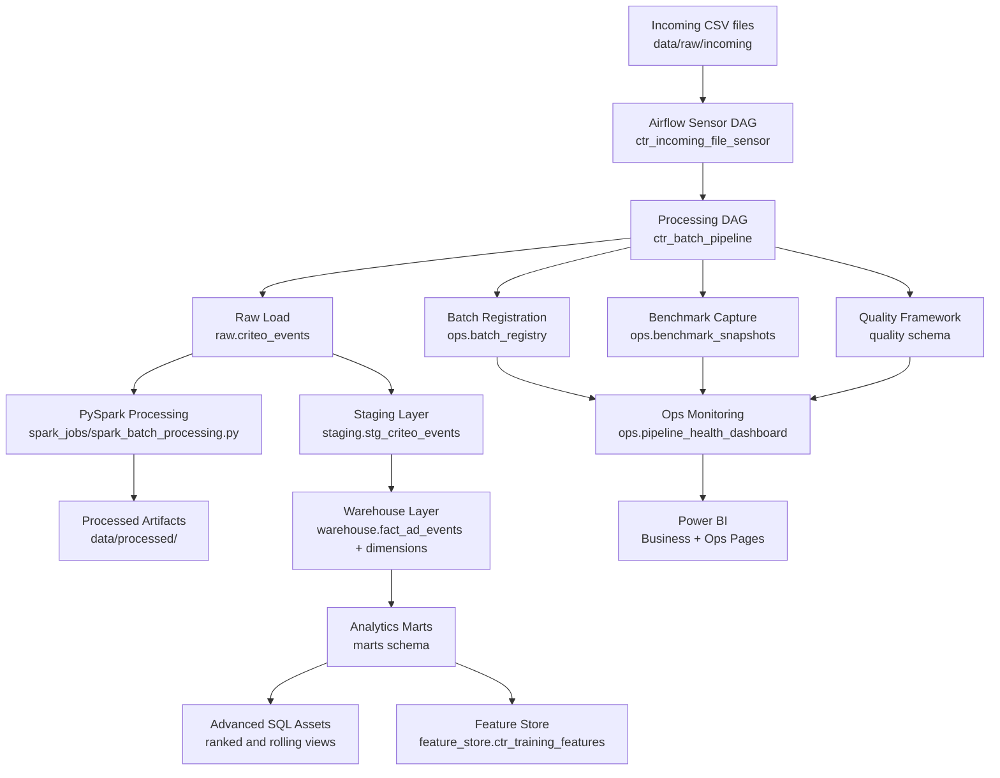

# Architecture Overview

## Platform Flow

## Main Design Choices

- PostgreSQL remains the serving warehouse and reporting source
- PySpark handles heavier batch preprocessing and profiling
- Airflow orchestrates lifecycle, retries, and batch progression
- `ops` stores metadata, runtime, and health visibility
- `quality` stores validation history and latest-run checks
- incoming batches are idempotent through checksum-based registration

## Current Entry Points

- production-style intake:
  - `ctr_incoming_file_sensor`
- processing DAG:
  - `ctr_batch_pipeline`
- manual Spark run:
  - `python3 spark_jobs/spark_batch_processing.py --sample 1m --batch-name <batch_name>`
